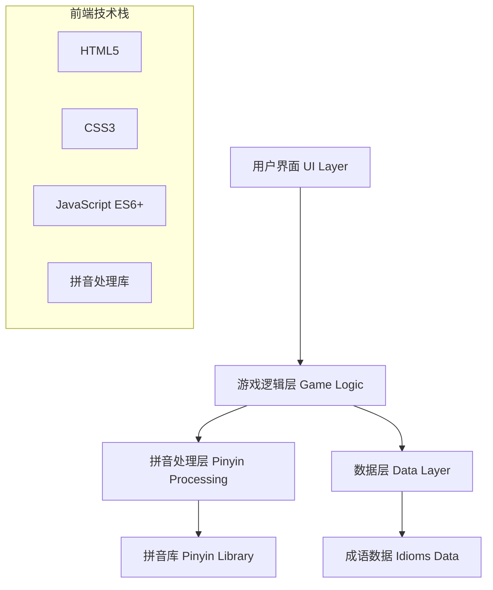

# 中文成语猜测游戏技术方案设计

## 系统架构

### 整体架构
采用纯前端单页应用（SPA）架构，无需后端服务器，所有逻辑在浏览器端执行。



## 技术栈

### 前端技术
- **HTML5**: 页面结构和语义化标签
- **CSS3**: 样式设计、动画效果、响应式布局
- **JavaScript ES6+**: 游戏逻辑、DOM操作、事件处理
- **拼音处理库**: 使用 `pinyin-pro` 或类似库处理汉字拼音转换

### 开发工具
- 现代浏览器（Chrome、Firefox、Safari、Edge）
- 无需构建工具，直接运行

## 核心模块设计

### 1. 数据层 (Data Layer)

#### 成语数据结构
```javascript
const idioms = [
    {
        text: "马到成功",
        pinyin: ["mǎ", "dào", "chéng", "gōng"]
    },
    // ... 更多成语
];
```

#### 拼音解析结构
```javascript
const pinyinStructure = {
    initial: "m",    // 声母
    final: "ǎ",      // 韵母
    tone: 3          // 声调
};
```

### 2. 拼音处理层 (Pinyin Processing)

#### 功能模块
- **拼音转换**: 汉字转拼音
- **拼音分解**: 分离声母、韵母、声调
- **拼音比较**: 逐个组件比较匹配度

#### 核心算法
```javascript
function decomposePinyin(pinyin) {
    // 使用拼音库分解声母、韵母、声调
    return {
        initial: extractInitial(pinyin),
        final: extractFinal(pinyin),
        tone: extractTone(pinyin)
    };
}
```

### 3. 游戏逻辑层 (Game Logic)

#### 状态管理
```javascript
const gameState = {
    answer: "",           // 正确答案
    attempts: [],         // 猜测历史
    currentAttempt: 0,    // 当前尝试次数
    maxAttempts: 10,      // 最大尝试次数
    gameStatus: "playing" // playing, won, lost
};
```

#### 核心算法
- **颜色判断算法**: 比较用户输入与答案的匹配度
- **游戏状态更新**: 处理每次猜测后的状态变化
- **胜负判断**: 检查游戏结束条件

### 4. 用户界面层 (UI Layer)

#### 组件结构
- **游戏标题**: 显示"汉兜"标题
- **输入区域**: 用户输入四字词语
- **结果展示区**: 显示猜测历史和颜色标识
- **控制按钮**: 确定、重新开始等操作
- **状态提示**: 剩余次数、游戏结果等信息

#### 样式设计
- **颜色方案**: 
  - 青色 (#4ECDC4): 正确位置
  - 橙色 (#FFB347): 错误位置
  - 灰色 (#95A5A6): 不存在
- **布局**: CSS Grid 实现网格布局
- **动画**: CSS3 动画实现彩带效果和过渡动画

## 数据库设计

### 成语数据集
- **数据来源**: 内置常用四字成语数组
- **数据量**: 500-1000个常用成语
- **数据格式**: JSON数组，包含成语文本和对应拼音

### 本地存储
- **游戏统计**: 使用 localStorage 存储游戏统计数据
- **用户偏好**: 存储主题设置等用户偏好

## 性能优化策略

### 1. 数据预处理
- 预先计算所有成语的拼音分解结果
- 缓存拼音处理结果避免重复计算

### 2. DOM操作优化
- 使用文档片段批量更新DOM
- 避免频繁的样式重计算

### 3. 内存管理
- 及时清理不需要的事件监听器
- 控制游戏历史记录的数量

## 安全性考虑

### 1. 输入验证
- 验证用户输入格式（必须为四个汉字）
- 防止XSS攻击的输入过滤

### 2. 数据完整性
- 确保成语数据的准确性
- 拼音数据的一致性检查

## 测试策略

### 1. 单元测试
- 拼音分解功能测试
- 颜色判断算法测试
- 游戏状态管理测试

### 2. 集成测试
- 完整游戏流程测试
- 用户界面交互测试

### 3. 兼容性测试
- 主流浏览器兼容性测试
- 移动端响应式测试

## 部署方案

### 静态部署
- 可部署到任何静态文件服务器
- 支持 GitHub Pages、Netlify、Vercel 等平台
- 无需服务器端配置

### 文件结构
```
/
├── index.html          # 主页面
├── css/
│   └── style.css      # 样式文件
├── js/
│   ├── game.js        # 游戏逻辑
│   ├── pinyin.js      # 拼音处理
│   └── idioms.js      # 成语数据
└── assets/
    └── icons/         # 图标资源
```