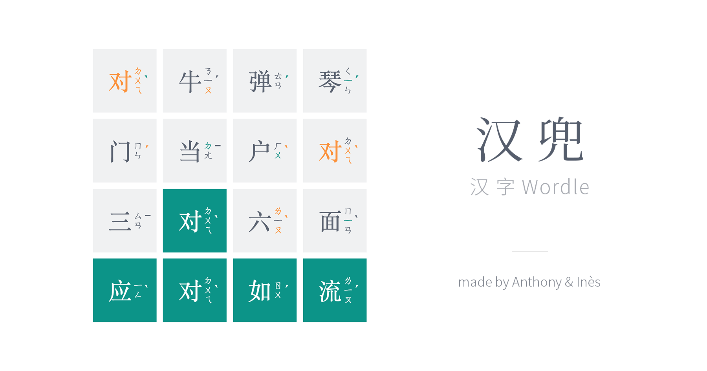

# 汉兜 Handle

A Chinese Hanzi variation of [Wordle](https://www.powerlanguage.co.uk/wordle/). 汉字 Wordle.

[handle.antfu.me](https://handle.antfu.me)

请勿剧透！PLEASE DO NOT SPOIL

## 游戏模式

汉兜现在支持两种游戏模式：

### 每日模式
- 每天一个固定的成语挑战
- 所有玩家挑战同一个成语
- 可以分享结果与朋友比较

### 无尽模式 🆕
- 无限制的成语挑战
- 随机生成成语，支持多种难度
- 实时统计游戏表现
- 适合练习和提升成语水平

点击页面右上角的模式切换按钮即可在两种模式间切换。

> **Note**
> 汉兜的答案库至 2023 年 2 月 28 日为止将**不再更新**；后序的题目将从过往一年的题目中随机抽取。仓库以 MIT 协议开放，在注明原始仓库与作者的条件下，欢迎 Fork 与修改。感谢大家的对汉兜的支持与喜爱。

## Development Setup

- Insall [Node.js](https://nodejs.org/en/) >=v16 and [pnpm](https://pnpm.io/)
- Run `pnpm install`
- Run `pnpm dev` and visit `http://localhost:4444`

## 成语勘误

成语数据库储存于

- [./src/data/idioms.txt](./src/data/idioms.txt) - 已知的成语列表
- [./src/data/polyphones.json](./src/data/polyphones.json) - 特殊发音的成语列表

二者互不包含。

如遇到成语缺失或发音错误，请编辑 [./src/data/new.txt](./src/data/new.txt) 文件，一行一词，完成后执行 `pnpm run update` 命令，脚本会自动抓取 [汉典](https://www.zdic.net/) 的数据更新成语数据库。如遇汉典中也缺失的成语，其会留存在 new.txt 中，需要手动判断与添加。

## Tech Stack

- [Vue 3](https://v3.vuejs.org/)
- [Vite](https://vitejs.dev/)
- [VueUse](https://vueuse.org/)
- [UnoCSS](https://github.com/antfu/unocss)
- [Vitesse Lite](https://github.com/antfu/vitesse-lite)

## License

[MIT](./LICENSE) License © 2021-PRESENT [Anthony Fu](https://github.com/antfu)
