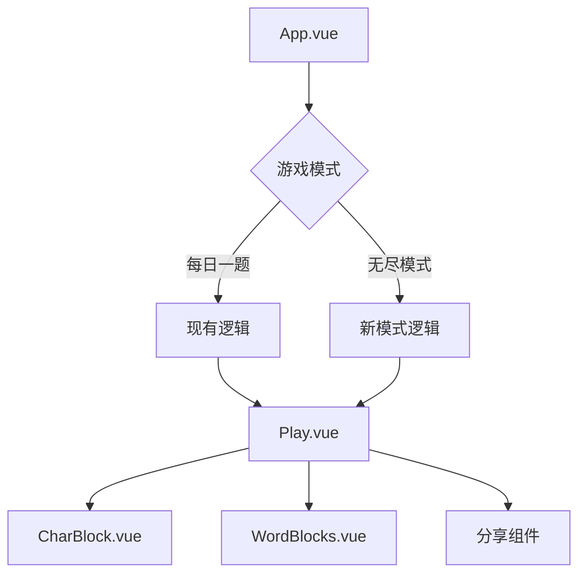
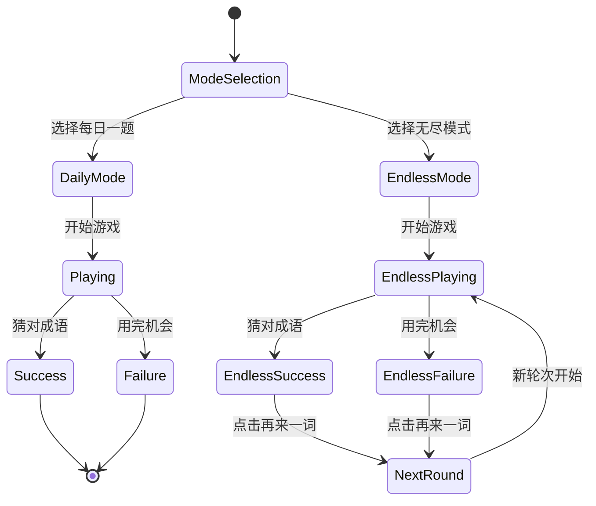

# 汉兜二次开发技术方案设计

## 架构设计

### 整体架构
采用状态驱动的单页面应用架构，基于现有Vue 3 + Composition API技术栈，通过状态管理实现模式切换，不引入额外的路由依赖。



### 状态架构
```typescript
// 核心状态结构
interface GameState {
  mode: 'daily' | 'endless'    // 游戏模式
  dailyState: DailyState        // 每日模式状态
  endlessState: EndlessState    // 无尽模式状态
}

interface DailyState {
  dayNo: number                 // 日期序号
  answer: Answer               // 当日答案
  tries: string[]              // 尝试记录
  meta: TriesMeta              // 元数据
}

interface EndlessState {
  round: number                // 当前轮次
  currentWord: string           // 当前成语
  tries: string[]              // 当前轮次尝试
  isFinished: boolean          // 是否完成
}
```

## 技术选型

### 保持现有技术栈
- **框架**: Vue 3.2.45 + Composition API
- **构建**: Vite 4.x
- **样式**: UnoCSS 0.47.x
- **状态**: VueUse + reactive
- **类型**: TypeScript 4.9.x
- **图标**: Iconify

### 新增依赖
无需新增主要依赖，保持项目轻量级特性。

## 核心模块设计

### 1. 模式管理模块 (mode.ts)
```typescript
import { ref, computed } from 'vue'

export type GameMode = 'daily' | 'endless'

// 当前游戏模式
const currentMode = ref<GameMode>('daily')

// 模式切换函数
export function switchMode(mode: GameMode) {
  currentMode.value = mode
}

// 模式判断computed
export const isDailyMode = computed(() => currentMode.value === 'daily')
export const isEndlessMode = computed(() => currentMode.value === 'endless')

// 重置模式状态
export function resetModeState(mode: GameMode) {
  if (mode === 'endless') {
    // 重置无尽模式状态
    resetEndlessState()
  }
}
```

### 2. 无尽模式引擎 (endless.ts)
```typescript
import { ref, computed } from 'vue'
import { getRandomIdiom } from './idioms'

// 无尽模式状态
const endlessRound = ref(1)
const currentWord = ref('')
const currentTries = ref<string[]>([])
const isRoundFinished = ref(false)

// 初始化无尽模式
export function initEndlessMode() {
  startNewRound()
}

// 开始新轮次
export function startNewRound() {
  currentWord.value = getRandomIdiom()
  currentTries.value = []
  isRoundFinished.value = false
  endlessRound.value++
}

// 检查是否完成当前轮次
export function checkRoundComplete(word: string): boolean {
  return word === currentWord.value
}

// 添加尝试记录
export function addEndlessTry(word: string) {
  currentTries.value.push(word)
  if (checkRoundComplete(word)) {
    isRoundFinished.value = true
  }
}
```

### 3. 随机成语生成器 (randomIdiom.ts)
```typescript
import idiomsData from '../data/idioms.txt?raw'

let idiomsCache: string[] | null = null

// 获取所有成语
function getAllIdioms(): string[] {
  if (!idiomsCache) {
    idiomsCache = idiomsData
      .split('\n')
      .map(line => line.trim())
      .filter(line => line.length === 4) // 只保留四字成语
  }
  return idiomsCache
}

// 获取随机成语
export function getRandomIdiom(): string {
  const idioms = getAllIdioms()
  const randomIndex = Math.floor(Math.random() * idioms.length)
  return idioms[randomIndex]
}

// 批量获取随机成语（避免重复）
export function getRandomIdioms(count: number, exclude: string[] = []): string[] {
  const idioms = getAllIdioms()
  const available = idioms.filter(idiom => !exclude.includes(idiom))
  
  if (available.length < count) {
    throw new Error('可用的成语数量不足')
  }
  
  const result: string[] = []
  const used = new Set(exclude)
  
  while (result.length < count) {
    const randomIndex = Math.floor(Math.random() * available.length)
    const selected = available[randomIndex]
    
    if (!used.has(selected)) {
      result.push(selected)
      used.add(selected)
    }
  }
  
  return result
}
```

## 组件设计

### 1. GameModeSelector.vue - 模式选择界面
```vue
<template>
  <div class="mode-selector">
    <div class="mode-cards">
      <div class="mode-card daily-mode" @click="selectMode('daily')">
        <div class="mode-icon">📅</div>
        <h2>每日一题</h2>
        <p>每天一个成语，挑战你的词汇量</p>
        <div class="mode-features">
          <span>✓ 每日更新</span>
          <span>✓ 全球同步</span>
          <span>✓ 历史记录</span>
        </div>
      </div>
      
      <div class="mode-card endless-mode" @click="selectMode('endless')">
        <div class="mode-icon">♾️</div>
        <h2>无尽模式</h2>
        <p>连续挑战，不断突破自我</p>
        <div class="mode-features">
          <span>✓ 无限挑战</span>
          <span>✓ 即时反馈</span>
          <span>✓ 连续记录</span>
        </div>
      </div>
    </div>
    
    <div class="mode-stats" v-if="hasGameHistory">
      <h3>游戏统计</h3>
      <div class="stats-grid">
        <div class="stat-item">
          <span class="stat-value">{{ totalGames }}</span>
          <span class="stat-label">总游戏数</span>
        </div>
        <div class="stat-item">
          <span class="stat-value">{{ winRate }}%</span>
          <span class="stat-label">胜率</span>
        </div>
        <div class="stat-item">
          <span class="stat-value">{{ currentStreak }}</span>
          <span class="stat-label">连续天数</span>
        </div>
      </div>
    </div>
  </div>
</template>

<script setup lang="ts">
import { computed } from 'vue'
import { switchMode } from '~/logic/mode'
import { gamesCount, passedCount, currentStreak } from '~/storage'

const emit = defineEmits<{
  modeSelected: [mode: 'daily' | 'endless']
}>()

function selectMode(mode: 'daily' | 'endless') {
  switchMode(mode)
  emit('modeSelected', mode)
}

const hasGameHistory = computed(() => gamesCount.value > 0)
const totalGames = computed(() => gamesCount.value)
const winRate = computed(() => {
  if (gamesCount.value === 0) return 0
  return Math.round((passedCount.value / gamesCount.value) * 100)
})
</script>
```

### 2. App.vue 修改方案
```vue
<template>
  <main font-sans text="center gray-700 dark:gray-300" select-none>
    <!-- 模式选择界面 -->
    <GameModeSelector 
      v-if="!modeSelected" 
      @mode-selected="onModeSelected" 
    />
    
    <!-- 游戏界面 -->
    <template v-else>
      <NotTodayBanner v-if="dayNo < daySince && isDailyMode" />
      <Navbar />
      <div p="4">
        <NoQuizToday v-if="!answer.word && isDailyMode" />
        <NoFuturePlay v-else-if="dayNo > daySince && !isDev && isDailyMode" />
        <NoPastPlay v-else-if="daySince - dayNo > DAYS_PLAY_BACK && !isDev && isDailyMode" />
        <Play v-else :mode="currentMode" @next-round="onNextRound" />
      </div>
      <ModalsLayer />
      <Confetti />
    </template>
  </main>
</template>

<script setup lang="ts">
import { ref, computed } from 'vue'
import { currentMode, isDailyMode, isEndlessMode } from '~/logic/mode'
import { initEndlessMode } from '~/logic/endless'

const modeSelected = ref(false)

function onModeSelected(mode: 'daily' | 'endless') {
  modeSelected.value = true
  if (mode === 'endless') {
    initEndlessMode()
  }
}

function onNextRound() {
  // 无尽模式开始新轮次
  if (isEndlessMode.value) {
    // 触发Play组件重置
  }
}
</script>
```

### 3. Play.vue 修改方案
```vue
<template>
  <!-- 现有模板... -->
  
  <!-- 无尽模式完成界面 -->
  <Transition name="fade-in">
    <div v-if="isEndlessMode && isFinished" class="endless-complete">
      <div class="complete-message">
        🎉 恭喜完成第 {{ endlessRound }} 轮！
      </div>
      <button class="next-round-btn" @click="startNextRound">
        再来一词
      </button>
    </div>
  </Transition>
</template>

<script setup lang="ts">
import { isEndlessMode } from '~/logic/mode'
import { startNewRound, endlessRound } from '~/logic/endless'

const props = defineProps<{
  mode: 'daily' | 'endless'
}>()

const emit = defineEmits<{
  nextRound: []
}>()

function startNextRound() {
  if (props.mode === 'endless') {
    startNewRound()
    // 重置游戏状态
    resetGameState()
    emit('nextRound')
  }
}

function resetGameState() {
  // 重置输入、尝试记录等
  input.value = ''
  inputValue.value = ''
  tries.value = []
  meta.value = {}
}
</script>
```

## 数据流设计

### 状态流转图


### 数据同步策略
1. **每日模式**: 保持现有数据同步逻辑
2. **无尽模式**: 
   - 不记录到历史统计
   - 只保存当前轮次状态
   - 新轮次完全重置状态

## 性能优化

### 1. 懒加载优化
```typescript
// 成语数据懒加载
const idiomsPromise = import('../data/idioms.txt?raw').then(m => m.default)

export async function getRandomIdiom(): Promise<string> {
  const idiomsData = await idiomsPromise
  // 处理数据...
}
```

### 2. 组件懒加载
```vue
<!-- 模式选择组件懒加载 -->
<script setup>
const GameModeSelector = defineAsyncComponent(() => 
  import('~/components/GameModeSelector.vue')
)
</script>
```

### 3. 状态缓存策略
- 模式选择状态：sessionStorage缓存
- 成语数据：内存缓存 + 异步加载
- 游戏状态：按需重置，避免内存泄漏

## 错误处理

### 1. 成语数据加载失败
```typescript
export async function getRandomIdiom(): Promise<string> {
  try {
    const idioms = await getAllIdioms()
    if (idioms.length === 0) {
      throw new Error('成语数据加载失败')
    }
    // 正常逻辑...
  } catch (error) {
    console.error('获取随机成语失败:', error)
    // 返回默认成语或错误提示
    return '万事如意' // 默认成语
  }
}
```

### 2. 模式切换异常
```typescript
function selectMode(mode: GameMode) {
  try {
    switchMode(mode)
    if (mode === 'endless') {
      initEndlessMode()
    }
    emit('modeSelected', mode)
  } catch (error) {
    console.error('模式切换失败:', error)
    // 显示错误提示，保持当前模式
    showToast('模式切换失败，请重试')
  }
}
```

## 测试策略

### 1. 单元测试
- 模式切换逻辑测试
- 随机成语生成器测试
- 状态管理测试

### 2. 集成测试
- 模式选择流程测试
- 无尽模式完整流程测试
- 数据一致性测试

### 3. 用户体验测试
- 界面响应性测试
- 模式切换流畅度测试
- 错误处理测试

## 部署方案

### 1. 构建配置
保持现有Vite配置，无需特殊调整。

### 2. 环境变量
```bash
# 可选：添加功能开关
VITE_ENABLE_ENDLESS_MODE=true
VITE_DISABLE_STRICT_MODE=true
```

### 3. 性能监控
- 模式切换时间监控
- 成语加载时间监控
- 错误率监控

## 扩展性考虑

### 1. 新模式扩展
状态设计支持后续添加更多游戏模式：
```typescript
type GameMode = 'daily' | 'endless' | 'timeattack' | 'multiplayer'
```

### 2. 主题系统
模式选择界面支持主题化：
```css
.mode-card {
  /* 支持CSS变量主题 */
  --mode-primary: var(--c-primary);
  --mode-secondary: var(--c-secondary);
}
```

### 3. 数据统计扩展
无尽模式可扩展统计维度：
- 连续正确轮次
- 平均用时趋势
- 难度分布统计

这份技术方案设计为二次开发提供了详细的技术指导和实现方案。